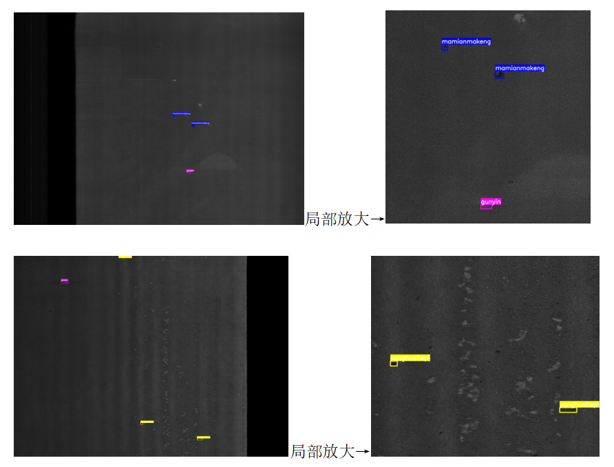

# 2026AIC-"AI+Steel" Surface Defect Detection

> Note: This markdown file is transcribed and summarized from the [original webpage](https://www.aicomp.cn/tracks/tracks-1/4174.html?_refluxos=a10&qq_aio_chat_type=2).
>
> [中文](./instruction_cn.md)

## I. Application Scenario

1. **Automated Surface Quality Inspection for Production Pipelines:** On high-speed pipelines carrying steel plates, utilizing computer vision algorithms to precisely locate surface defects—such as cracks, scratches, and scabs—in real-time. Enabling real-time injection and grading especially for pipelines running at high production rates.

2. **Artifact Filtering and Precise Recognition in Complex Operating Conditions:** Real-world industrial environments often involve extreme disturbances such as water stains, oil contamination, dust, and detached iron oxide scale. The vision model should be able to effectively distinguish genuine defects from artifacts caused by the production environment, maintaining high-precision perception even under conditions like water vapor obstruction or complex background textures.

3. **Running Effectively on Other Sets:** Existing models often underperform due to domain gaps, because of significant variations across production lines in terms of camera hardware, lighting conditions, product types, and thickness specifications. Visual algorithms with strong generalization capabilities should effectively overcome these cross-domain challenges, enabling models to rapidly adapt to new production lines and steel grades.

> In machine learning and data science, a domain gap (or domain shift) is the performance drop that occurs when a model trained on one dataset (the source domain) is applied to a different, though related, dataset (the target domain).

## II. Task

1. Defect Detection and Precise Localization

    Develop a high-precision visual model to accurately identify various surface defects on metal plates:

    1. 纵裂 (Longitudinal Crack): A crack running parallel to the rolling direction of the steel.
    2. 夹杂 (Inclusion): Non-metallic foreign particles trapped inside or on the surface of the steel.
    3. 麻面麻坑 (Pitted Surface): Clusters of small, irregular depressions or craters on the steel surface.
    4. 氧化铁皮 (Mill Scale): A flaky layer of iron oxides formed during the hot rolling process.
    5. 辊印 (Roll Mark): Periodic indentations or raised marks caused by a damaged or dirty roller.
    6. 异物压入 (Pressed-in Foreign Matter): External debris or particles pressed into the steel surface during rolling.
    7. 划伤 (Scratch): Linear grooves or scores caused by mechanical friction against sharp objects.
    8. 结疤 (Scab): A shell-like layer of metal adhered to the steel surface, often caused by splashing during casting.
    9. 气裂 (Gas Crack): Surface ruptures caused by trapped gas bubbles expanding during processing.

    The model outputs the specific defect category and the coordinates of its bounding box. Precision and Recall serve as the core evaluation metrics. Examples of some defect categories are shown below:

    

2. Hard Sample and Cross-Line Generalization Optimization

    Target extremely imbalanced long-tailed data (especially rare but fatal defects like cracks), designing algorithmic strategies to maximize the recall rate and eliminate any missed detections (false negatives).

    > Long-tailed data refers to a dataset where a few categories appear very frequently, while the vast majority of categories appear rarely.
    >
    > When plotted on a graph of frequency versus category, it forms a shape with a tall "head" on the left and a very long, thin "tail" stretching to the right.
    >
    > ```text
    >  Frequency
    > ▲
    > │  █
    > │  █ █                  ◄── "Head": Common classes (e.g., Scratch, Roll Mark)
    > │  █ █ █
    > │  █ █ █ █ ▄ ▄ ▄ _ _ _ _ _ _ _ _ _ _ _ _ _ _ ◄── "Tail": Rare classes (e.g., Fatal Crack)
    > └──────────────────────────────────────────►
    >                                     Categories
    > 
    > ```
    >
    > Nature and industries naturally produce long-tailed data. In steel manufacturing, minor scratches happen daily (head), but critical structural cracks happen rarely (tail). In these datasets, the rarest classes (the tail) are often the most critical to detect, but they are the hardest for AI to learn.

## III. I/O Specifications

### (I) Input

- Image Data: Images are primarily captured by ultra-high-resolution industrial cameras (4096 × 3000 pixels) in .jpg or .png format.
- Annotation Data (PASCAL VOC Format): Each image is accompanied by a matching .xml annotation file of the same name. The annotation file contains detailed information about the image and the precise locations of the defect targets. The core fields include:

  - `<size>`: Contains the image width, height, and number of channels (depth).
  - `<object>`: Each individual defect target corresponds to an `<object>` block.
  - `<name>`: The Pinyin or English abbreviation of the defect category (e.g., zonglie for longitudinal crack, jiaza for inclusion, etc.).
  - `<bndbox>`: The bounding box coordinates of the defect, consisting of the top-left corner (xmin, ymin) and the bottom-right corner (xmax, ymax). These coordinate values represent absolute pixel positions.

### (II) Output

The model must process every image in the test set. The prediction results for all images should be aggregated and bundled into a single JSON format file for submission. The evaluation system will automatically parse this JSON file and calculate evaluation metrics, such as mAP (Mean Average Precision), against the hidden Ground Truth labels

The submitted JSON file must be a List, where each Dictionary in the list represents a single predicted defect target. The specific field definitions are as follows:

```json
[
  {
    "image_id": "0001400166-Raw00-f_00006.jpg",
    "category_name": "roll_mark",
    "bbox": [2560, 1520, 2615, 1539],
    "score": 0.95
  },
  {
    "image_id": "0001469760_Raw13_f_00003.jpg",
    "category_name": "scratch",
    "bbox": [648, 702, 1681, 750],
    "score": 0.88
  },
  {
    "image_id": "0001388270-Raw01-f_00001.jpg",
    "category_name": "inclusion",
    "bbox": [1148, 2178, 1191, 2335],
    "score": 0.92
  },
  {
    "image_id": "0001400264-Raw03-f_00009.jpg",
    "category_name": "scab",
    "bbox": [1108, 2, 1213, 118],
    "score": 0.91
  },
  {
    "image_id": "0001388609-Raw00-f_00007.jpg",
    "category_name": "pitted_surface",
    "bbox": [1459, 1524, 1502, 1561],
    "score": 1.0
  },
  {
    "image_id": "0001417541-Raw00-f_00005.jpg",
    "category_name": "gas_crack",
    "bbox": [1084, 2243, 1150, 2400],
    "score": 1.0
  },
  {
    "image_id": "0001389511-Raw02-f_00002.jpg",
    "category_name": "mill_scale",
    "bbox": [2856, 1290, 2874, 1333],
    "score": 1.0
  },
  {
    "image_id": "0001400166-Raw01-f_00001.jpg",
    "category_name": "pressed_in_foreign_matter",
    "bbox": [3648, 2607, 3688, 2651],
    "score": 1.0
  },
  {
    "image_id": "0001388270-Raw01-f_00001.jpg",
    "category_name": "longitudinal_crack",
    "bbox": [3153, 1473, 3184, 2037],
    "score": 1.0
  }
]
```

## IV. Dataset and Data Description

### (I) Data Source

The dataset provided for this competition consists of real industrial production line data. All image data originates from the surface quality online inspection system of Nanjing Iron and Steel Co., Ltd. (core production lines such as medium and heavy plates), captured in real-time by high-resolution industrial line-scan cameras under high-speed rolling mill operating conditions. After rigorous manual screening and high-precision expert annotation, the exclusive dataset for this competition was constructed.

All data is guaranteed to come from legal and compliant sources, and is explicitly authorized only for academic exploration, algorithm verification, and non-commercial purposes within this competition.

### (II) Data Scale and Division

The dataset provided for the competition contains approximately 5,000 high-resolution industrial images. To comprehensively and objectively evaluate the performance of the contestants' models, the dataset will be divided into a training set, a preliminary round test set, a semi-final round test set, and a grand final test set. The data division for each stage is as follows:

- **Training Set:** Contains approximately 3,200 defect images with precise manual annotation bounding boxes, used for contestants to train their computer vision detection models. This training set includes 9 classes. Due to small inter-class differences, some classes have been merged in the training set, including:

| Merged Category | Original Category | Quantity |
| :--- | :--- | :--- |
| `scab` (结疤) | Scab, Double Skin, Roll Damage (结疤、重皮、轧损) | 604 |
| `longitudinal_crack` (纵裂) | Longitudinal Crack (纵裂) | 296 |
| `gas_crack` (气裂) | Bubble Crack, Transverse Crack (气裂、横裂) | 28 |
| `inclusion` (夹杂) | Inclusion (夹杂) | 113 |
| `pressed_in_foreign_matter` (异物压入) | Scale Dropping, Edge Press-in, Pit, Foreign Matter Press-in, Double-sided Shear Press Mark, Fixed-length Shear Press Mark (掉渣、边丝压入、压坑、异物压入、双边剪压痕、定尺剪压痕) | 464 |
| `scratch` (划伤) | Scratch (划伤) | 60 |
| `pitted_surface` (麻面麻坑) | Pitted Surface, Pit (麻面、麻坑) | 309 |
| `mill_scale` (氧化铁皮) | —— | 358 |
| `roll_mark` (辊印) | Bulge, Bump (鼓包、凸块) | 236 |

- **Preliminary Round Test Set:** Contains approximately 800 unlabeled images, with a data distribution basically consistent with the training set, used for objective evaluation during the preliminary round phase.

- **Semi-Final & Grand Final Test Sets:** Contains approximately 1,000 unlabeled images. This part of the data introduces complex samples from different production lines to test the generalization ability of the models under **Domain Shift**.

### (III) Data Characteristics

The dataset provided highly restores a harsh real-world industrial sensing environment and possesses the following prominent characteristics:

1. **Data Type and Scale:** The data consists of ultra-high-resolution single-channel grayscale images (typical resolution is 4096×3000). The scale span of target defects is extremely large, ranging from long, strip-shaped "longitudinal cracks (zonglie)" that span the screen to tiny "inclusions (jiaza)" that occupy only dozens of pixels.

2. **Long-tail Distribution:** Since severe defects are extremely rare on actual high-quality production lines, the categories in the dataset exhibit a typical long-tail distribution. Common minor defect samples are relatively abundant, whereas fatal defect samples are scarce.

3. **Complex Background Interference:** The image backgrounds naturally overlay high-intensity pseudo-noise such as water stains, oil stains, dust, and normal water jet cutting traces from the actual production line.

### (IV) Preprocessing Description

In order to reduce the data cleaning costs for the contestants and focus on the algorithm itself, the organizers have performed basic preprocessing on the originally collected data:

1. **Data Cleaning:** Removed completely black/completely white invalid frames caused by high-frequency flashing of the camera light source, as well as completely meaningless empty background frames.

2. **Format Standardization:** Decoded the RAW data collected by different underlying sensors, performed contrast stretching, and uniformly converted them into standard 8-bit `.jpg` format images.

3. **No Cropping and Normalization Applied:** To retain the global context information of the defects, the organizers did not forcibly crop or scale-normalize the original ultra-high-resolution images. Contestant teams need to design their own data loading strategies for resizing, cropping, and tensor normalization based on the foundation large models or object detection networks (such as the YOLO series) they adopt.

    > YOLO (You Only Look Once) is a revolutionary family of real-time computer vision models that frames object detection as a single regression problem rather than a classification task. Unlike older multi-stage methods (such as R-CNN) that look at an image thousands of times by processing sub-regions, YOLO passes the entire image through a convolutional neural network (CNN) exactly once. This unified pipeline predicts bounding boxes and class probabilities simultaneously, delivering extreme processing speeds suitable for live video streams.

### (IV) Data Format

The competition training dataset is organized using the classic **PASCAL VOC** format. Each set of training data consists of an image file and a corresponding text annotation file with the same name.

- **Image File:** Standard `.jpg` format, with naming rules such as `0001388270-Raw01-f_00001.jpg`.
- **Annotation File:** Standard `.xml` format. The file contains basic attributes of the image (width, height, channel depth) as well as detailed information about the defect targets.

For each defect in the image, the annotation information is stored within the `<object>` tag. The core fields include:

- `<name>`: The unique identifier of the defect category (e.g., `longitudinal_crack`, `scab`, etc.).
- `<bndbox>`: The absolute pixel coordinate bounding box of the target defect, consisting of the absolute relative values (integers) of the top-left corner `[xmin, ymin]` and the bottom-right corner `[xmax, ymax]`, with values ranging within `[0, image width/height]`.

## V. Algorithm Design Requirements

### (I) Model Types

Contestants are encouraged to adopt and deeply optimize deep learning object detection algorithms tailored for industrial vision scenarios. Priority support is given to technical routes centered around mainstream computer vision architectures, including but not limited to:

- High-efficiency detection algorithms based on Convolutional Neural Networks (such as the **YOLO series**)
- Detection models based on Vision Transformers (such as the **DETR series**), etc.

This aims to fully leverage the core advantages of deep learning algorithms in fine-grained feature extraction, anti-interference against complex backgrounds, and industrial-grade high-cycle real-time inference.

### (II) Innovation

Contestant teams are encouraged to propose innovative improvement schemes addressing the pain points of visual inspection in real industrial environments, with a particular focus on enhancing the model's precise perception of multi-scale defects and its generalization capability across different production lines. For example, to address shortcomings such as strong pseudo-artifact interference on plate surfaces (e.g., masking by water and oil stains) or the missed detection of fatal defects (e.g., microscopic cracks), contestants can design specialized noise-resistant feature extraction networks, multi-source feature fusion mechanisms, or **Domain Adaptation** modules to strengthen the model's recognition precision and localization accuracy under long-tail data distributions.

## VI. Performance Metric Requirements

This competition topic focuses on the precise detection of surface defects on plates. In light of the actual business requirement of real industrial production lines—**"a small number of false alarms are acceptable, but missed detections are strictly forbidden"**—this competition adopts **Precision** and **Recall** as the core metrics to evaluate the performance of the competing models.

The contestants' algorithm models must pursue the highest possible **Recall** while ensuring a foundational baseline **Precision**.
